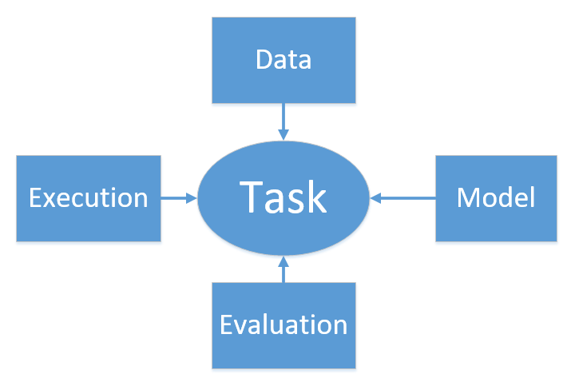
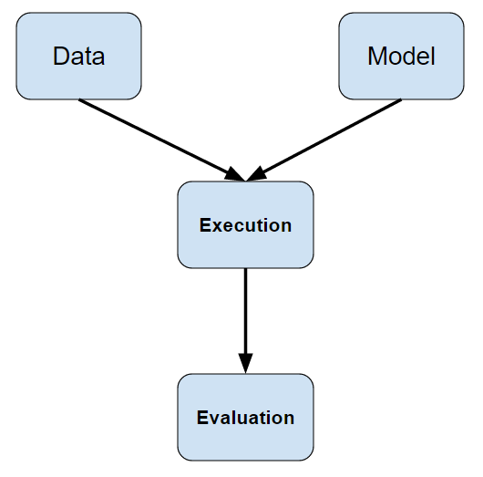

# Deep Learning Framework based on Theano

## Requirements

- Python3
- Theano >= 0.9
- scipy
- Numpy
- Matplotlib
- xlwt
- nltk

## Design Philosophy

Totally speaking, in every task, **_the operation flow/process is unchanged_** and **_the only
changing thing is just the specific operation in each operation_**. (业务流程是不变的，变化的只是
具体的业务。)

Every artificial intelligence(AI) task involves four components: **Model**, **Data**, 
**Execution** and **Evaluation**.

The process of AI task is as follows:

So, by extracting the unchanged process, we got our deep learning framework.

Thdl framework contains four modules:
 
- **data**: for processing AND providing data;
- **model**: for building neural models;
- **exeval**: for executing and evaluating models using provided data;
- **task**: for building a task.

## Features

- Support commonly used models, including convnets, RNNs and LSTMS.
- Support visualization of evaluation results.

## Example
    
    from thdl.data import text_classification as corpus
    from thdl import model
    from thdl.exeval import ClassifyExeEval
    from thdl.task import ClassificationTask
    
    
    # data
    data_getter = corpus.SentenceGetter('./files/handled/trec.data')
    data_processor = corpus.SentenceProcessor()
    data_module = corpus.SentenceProvider(shuffle=True)
    data_module.set_getter(data_getter)
    data_module.set_processor(data_processor)
    data_module.build()
    
    # model
    model_module = model.Model()
    model_module.set_input_tensor(model.tensors.imatrix())
    model_module.add_layer(model.layers.Embedding(data_module.get_embedding()))
    model_module.add_layer(model.layers.Dropout(0.5))
    model_module.add_layer(model.layers.LSTM(n_out=200))
    model_module.add_layer(model.layers.Mean(axis=1))
    model_module.add_layer(model.layers.Softmax(n_out=len(data_module.index_to_tag)))
    model_module.set_output_tensor(model.tensors.fmatrix())
    model_module.set_objective(model.objective.CategoricalCrossEntropy())
    model_module.set_optimizer(model.optimizer.Adam(learning_rate=0.0001))
    model_module.set_metrics([model.metrics.CategoricalAccuracy(),
                              model.metrics.Loss()],
                             model.metrics.Regularizer())
    model_module.build()
    
    # execution and evaluation
    exeval_module = ClassifyExeEval(batch_size=50)
    exeval_module.set_aspects('training', 'valid', 'test')
    
    # task
    task = ClassificationTask()
    task.set_model(model_module)
    task.set_data(data_module)
    task.set_exeval(exeval_module)
    # task.set_logfile()
    
    # run
    task.hold_out_validation()

